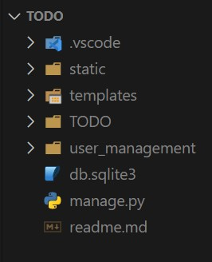

# Documentation: TODO App By Python ( Django )

========================================================================

## 📌 Introduction

<br>

**This documentation provides instructions for building and running this Django Application.**

**This TODO application has been developed using the Django web framework of Python.**

**Before proceeding with the steps below, make sure you have all the necessary prerequisites installed.**

## 📌 Prerequisites:-

- Python 3.9 or Higher

## 📌 Process of Building and Running this Django Application

<br>

**Django Commands Used:**

```bash
  Initialize a Django Project:

  django-admin startproject "project_name"

  In our case:
  django-admin startproject TODO
```

```bash
  Create an app inside Django:

  python manage.py startapp "app_name"

  In our case:
  python manage.py startapp user_management
```

<br>

**Clone the repository to your local machine by using `git clone` command in terminal ( git bash, powershell etc )**

```bash
  git clone https://github.com/Debashish-Rath/django-todo-app.git
```

**Navigate to the project's root directory by using `cd TODO` command.**

**Now, your directory structure would be something like this ( refer to the image below ):**



<br>

**Create a Virtual Environment and install the dependencies from the requirements.txt file.**

```bash
  pip install virtualenv
```

```bash
  virtualenv venv
```

##### ( Here, "venv" is the virtual environment name; Any name can be given here )

<br>

##### Now, Activate the virtual environment which we created just above step:

( For Windows )

```bash
  .\venv\Scripts\activate
```

( For Linux & Mac )

```bash
  source venv/bin/activate
```

##### Install the dependencies from requirements.txt file

```bash
  pip install -r requirements.txt
```

**Now run the application by using below command:**

```bash
  python manage.py runserver
```

<br>

## ---- Thank You ----
